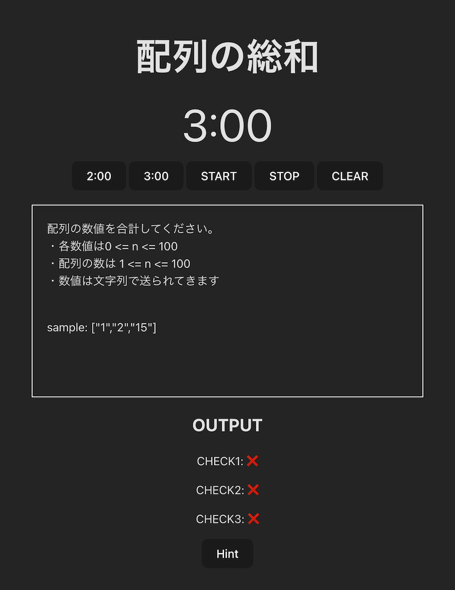

# JS Work Book



## 概要

-   社内勉強会で使用する基礎的な問題集
-   モブプロなどで実施する予定
-   回答は難読化のために暗号化している（セキュリティのためのものではない）

## 起動

-   `corepack pnpm run dev`

## 回答方法・ルール

-   基本ウェブ検索、ChatGPT 等の AI 使用禁止
-   `/src/answer.ts` に記述する
-   String を Return する
-   CHECK が全て ⭕️ になれば正解

## 問題の作成方法

-   `/src/config/data.json` に問題を作成

```
{
    id: string
    title: string
    description: string
    data: string[] // 回答する際に与えられるデータ
    answer: string[] // data を与えられた際の回答、data.length === answer.length
}
```

-   data の中に与えられる値を String 配列で記入
-   answer の中に data によって導き出される正解を String 配列で記入（data の数と answer の数を一致させる）
-   main.ts で複合している部分を暗号化に切り替え、console で出力し、暗号化したものを data.json に記述しなおす
